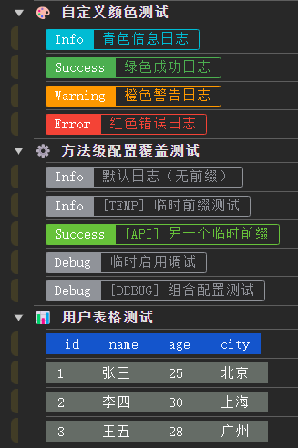
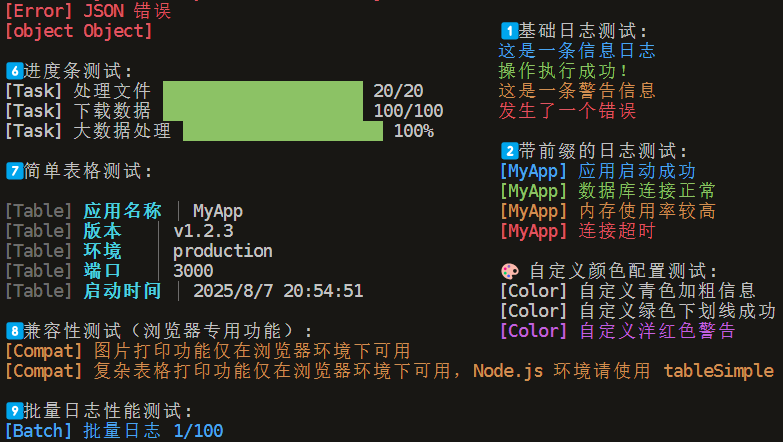

# 🎨 @jl-org/log

<div align="center">

**A Beautiful Cross-Platform Logging Tool** ✨

*Colorful log output for both Browser and Node.js environments*

[](https://www.npmjs.com/package/@jl-org/log)
[](https://github.com/beixiyo/jl-log/blob/main/LICENSE)
[](https://www.npmjs.com/package/@jl-org/log)

**English** | [中文](./README.md)

</div>

## ✨ Key Features

| Feature | Description | Status |
|---------|-------------|--------|
| 🌐 **Cross-Platform** | Seamless switching between Browser + Node.js environments | ✅ |
| 🎨 **Beautiful Output** | Browser color tags + Node.js *kleur* colored terminal | ✅ |
| 📦 **Lightweight** | Zero core dependencies, Node.js *kleur* on-demand | ✅ |
| 🔧 **Unified API** | Same interface for both environments, low learning curve | ✅ |
| 🎯 **TypeScript** | Complete type definitions, great development experience | ✅ |
| ⚡ **High Performance** | Optimized rendering algorithms, millisecond response | ✅ |

## 📸 Effect Preview

### 🖥️ Browser Environment



*Colorful tag effects in browser console*

### 🖥️ Node.js Terminal



*Colored text effects in Node.js terminal*

---

## 📦 Quick Installation

### Basic Installation

```bash
# Using pnpm (recommended)
pnpm add @jl-org/log

# Using npm
npm install @jl-org/log

# Using yarn
yarn add @jl-org/log
```

### Additional Dependencies for Node.js

For Node.js environment, please install *kleur*:

```bash
pnpm add kleur@^4.1.5
```

> 💡 **Why do users need to install kleur?**  
> To keep the package lightweight and flexible, we set *kleur* as a peer dependency. This way, browser environments won't include unnecessary dependencies.

## 🚀 Quick Start

### 🌐 Browser Environment

```html
<!DOCTYPE html>
<html>
<head>
  <title>Logger Demo</title>
</head>
<body>
  <script type="module">
    import { BrowserLogger } from '@jl-org/log'

    // Create logger instance
    const logger = new BrowserLogger({
      needLog: () => process.env.NODE_ENV !== 'production',
      prefix: 'MyApp',
      debug: true
    })

    // Basic usage
    logger.info('🚀 Application started successfully')
    logger.success('✅ Data loaded')
    logger.warn('⚠️ High memory usage')
    logger.error('❌ Network connection failed')
    logger.debug('🐛 Debug information')

    // Method-level configuration override
    logger.info('Temporary prefix test', { prefix: 'TEMP' })
    logger.debug('Temporarily enable debug', { debug: true })
    logger.error('API error', null, { prefix: 'API' })

    // Table display
    const users = [
      { id: 1, name: 'John', role: 'Admin' },
      { id: 2, name: 'Jane', role: 'User' }
    ]
    logger.table(users)

    // Image display (browser only)
    logger.img('https://example.com/logo.png', 0.5)
  </script>
</body>
</html>
```

### 🖥️ Node.js Environment

```js
import kleur from 'kleur'
import { NodeLogger } from '@jl-org/log'

// Create logger instance
const logger = new NodeLogger({
  kleur,
  debug: process.env.NODE_ENV === 'development',
  prefix: 'MyApp'
})

// Basic usage
logger.info('🚀 Server started successfully')
logger.success('✅ Database connected')
logger.warn('⚠️ High memory usage')
logger.error('❌ Redis connection failed')
logger.debug('🐛 Debug info: User ID = 12345')

// Method-level configuration override
logger.info('Temporary prefix test', { prefix: 'TEMP' })
logger.debug('Temporarily enable debug', { debug: true })
logger.error('API error', null, { prefix: 'API' })

// Custom color configuration
const colorLogger = new NodeLogger({
  kleur,
  prefix: 'App',
  colors: {
    infoColor: 'cyan.bold',        // Bold cyan
    successColor: 'green.underline', // Green underline
    warningColor: 'magenta',       // Magenta
    errorColor: 'red.bold.bgWhite' // Bold red on white background
  }
})

colorLogger.info('Custom styled info log')
colorLogger.success('Custom styled success log')

// Progress bar (Node.js only)
for (let i = 0; i <= 100; i += 10) {
  logger.progress({
    message: 'Processing data',
    current: i,
    total: 100,
    displayType: 'percentage'
  })
  await new Promise(resolve => setTimeout(resolve, 100))
}

// Simple table
logger.tableSimple({
  'App': 'MyApp',
  'Version': 'v1.0.0',
  'Environment': 'production',
  'Port': '3000'
})
```

## 📖 Detailed Documentation

### 🎨 BrowserLogger Configuration

```typescript
interface LogOpts {
  /** Enable logging with dynamic control */
  needLog?: () => boolean
  
  /** Enable debug mode */
  debug?: boolean
  
  /** Log prefix */
  prefix?: string
  
  /** Custom color configuration */
  infoColor?: string     // Default: #909399
  errorColor?: string    // Default: #F56C6C  
  warningColor?: string  // Default: #E6A23C
  successColor?: string  // Default: #67C23A
  
  /** Table style configuration */
  table?: {
    header?: {
      color?: string     // Default: #F2F7FF
      bgc?: string       // Default: #1455CC
    }
    row?: {
      color?: string     // Default: #FFF
      bgc?: string       // Default: #656C66
    }
  }
}

/** Method-level configuration options - allows temporary override of constructor config */
interface MethodConfig {
  /** Temporarily override prefix */
  prefix?: string
  /** Temporarily override debug mode */
  debug?: boolean
}
```

### 🖥️ NodeLogger Configuration

```typescript
interface NodeLogOpts extends BaseLogOpts {
  /** Kleur instance (required) */
  kleur: Kleur
  
  /** Color configuration */
  colors?: KleurColorConfig
}

interface KleurColorConfig {
  /** Info log color, supports all kleur color methods, default: 'blue' */
  infoColor?: string
  /** Success log color, default: 'green' */
  successColor?: string
  /** Warning log color, default: 'yellow' */
  warningColor?: string
  /** Error log color, default: 'red' */
  errorColor?: string
  /** Debug log color, default: 'gray' */
  debugColor?: string
}
```

### 🔧 Common Interface

```typescript
interface ILogger {
  info(message: string, config?: MethodConfig): void
  success(message: string, config?: MethodConfig): void  
  warn(message: string, config?: MethodConfig): void
  error(message: string, error?: any, config?: MethodConfig): void
  debug?(message: string, config?: MethodConfig): void
  img?(url: string, scale?: number): void
  table?<T extends object>(data: T[]): void
}
```

## ⚡ Advanced Usage

### 🎨 Custom Themes

```js
// Dark theme
const darkLogger = new BrowserLogger({
  infoColor: '#64B5F6',
  successColor: '#81C784', 
  warningColor: '#FFB74D',
  errorColor: '#E57373'
})

// Rainbow theme  
const rainbowLogger = new BrowserLogger({
  infoColor: '#9C27B0',
  successColor: '#4CAF50',
  warningColor: '#FF9800', 
  errorColor: '#F44336'
})
```

### 🚀 Performance Optimization

```js
// Disable logging in production
const logger = new BrowserLogger({
  needLog: () => process.env.NODE_ENV !== 'production'
})

// Conditional logging
const logger = new BrowserLogger({
  needLog: () => window.location.search.includes('debug=true')
})
```

### 📊 Data Visualization

```js
// Complex data table
const complexData = [
  { 
    id: 1,
    user: { name: 'John', email: 'john@example.com' },
    stats: { views: 1234, likes: 89 },
    active: true 
  }
]
logger.table(complexData)
```

## 🔍 Feature Comparison

| Feature | 🌐 Browser | 🖥️ Node.js | 📝 Description |
|---------|------------|-------------|----------------|
| **Basic Logging** | ✅ | ✅ | info, success, warn, error |
| **Debug Logging** | ✅ | ✅ | debug method with control |
| **Prefix Support** | ✅ | ✅ | Unified custom prefix support 🆕 |
| **Method-level Config** | ✅ | ✅ | Temporary override prefix, debug, etc. 🆕 |
| **Error Stack** | ✅ | ✅ | Support Error object display |
| **Table Printing** | ✅ | ⚠️ | Full support in browser, simplified in Node.js |
| **Image Printing** | ✅ | ❌ | Browser only, Node.js shows warning |
| **Progress Bar** | ❌ | ✅ | Node.js exclusive feature |
| **Colored Output** | ✅ | ✅ | CSS styles vs kleur terminal colors |

## 🧪 Testing

We provide comprehensive test examples demonstrating all functionality:

### 📁 Test Files Overview

- **[`test/browser.html`](./test/browser.html)** - Browser test page with beautiful UI interface
- **[`test/browser.js`](./test/browser.js)** - Browser test script with all feature demonstrations  
- **[`test/node.js`](./test/node.js)** - Node.js test script with complete functionality tests

### 🌐 Browser Testing

```bash
# Build project
pnpm build

# Start test server (requires live-server)
npx live-server test/
```

Then open `http://localhost:8080/browser.html` in browser and press F12 to see console output.

**Test Coverage Includes:**
- 🎯 Basic logging functionality
- 🆕 Prefix and debug mode
- ⚙️ Method-level configuration override  
- 🎨 Custom color themes
- 📊 Table data display
- 🖼️ Image printing functionality

### 🖥️ Node.js Testing

```bash
# Install test dependencies
pnpm add kleur

# Build and run tests
pnpm build && node test/node.js
```

**Test Coverage Includes:**
- 🎯 Basic logging functionality
- 🆕 Method-level configuration override
- 🏷️ Prefix and debug mode
- 📊 Progress bar display
- ⚡ Performance testing

## 📋 Best Practices

### 🏗️ Project Integration

```js
// utils/logger.js
import { BrowserLogger } from '@jl-org/log'

export const logger = new BrowserLogger({ })

// Usage
import { logger } from './utils/logger'
logger.info('User logged in successfully')
```

### 🎯 Type Safety

```typescript
// types/logger.d.ts
import type { BrowserLogger } from '@jl-org/log'

declare global {
  interface Window {
    logger: BrowserLogger
  }
}

// Global usage
window.logger = new BrowserLogger()
window.logger.info('Perfect TypeScript support')
```

### 🔧 Development Setup

```bash
# Clone project
git clone https://github.com/beixiyo/jl-log.git
cd jl-log

# Install dependencies
pnpm install

# Development build
pnpm build

# Run tests
pnpm test
```

---

<div align="center">

**If this project helps you, please give it a ⭐ Star!**

Made with ❤️ by [CJL](https://github.com/beixiyo)

</div> 