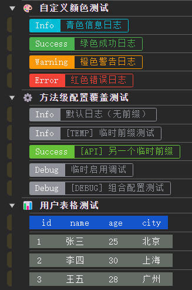
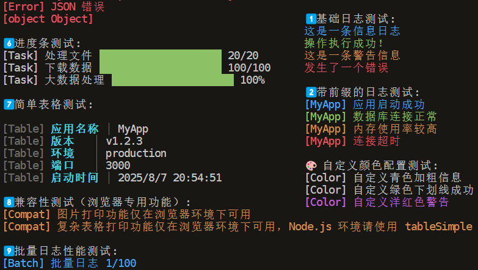

# 🎨 @jl-org/log

<div align="center">

**A Beautiful Cross-Platform Logging Tool** ✨

*Zero-dependency, colorful log output for both Browser and Node.js*

[](https://www.npmjs.com/package/@jl-org/log)
[](https://github.com/beixiyo/jl-log/blob/main/LICENSE)
[](https://www.npmjs.com/package/@jl-org/log)

**English** | [中文](./README.md)

</div>

## ✨ Key Features

| Feature | Description | Status |
|---------|-------------|--------|
| 🌐 **Cross-Platform** | Seamless switching between Browser + Node.js environments | ✅ |
| 🎨 **Beautiful Output** | Browser color tags + Node.js self-implemented ANSI colored terminal | ✅ |
| 📦 **Zero Dependencies** | No external dependencies at all, self-implemented color system (kleur removed in 2.0.0) | ✅ |
| 🔧 **Unified API** | Same interface for both environments, low learning curve | ✅ |
| 🎯 **TypeScript** | Complete type definitions, great development experience | ✅ |
| ⚡ **High Performance** | Optimized rendering, millisecond-level response | ✅ |

## 📸 Effect Preview

### 🖥️ Browser Environment



*Colorful tag effects in the browser console*

### 🖥️ Node.js Terminal



*Colored text effects in the Node.js terminal*

---

## 📦 Installation

```bash
# Using pnpm (recommended)
pnpm add @jl-org/log

# Using npm
npm install @jl-org/log

# Using yarn
yarn add @jl-org/log
```

### Node.js Environment Support

The Node.js environment ships with built-in color support — no extra dependencies required.

> 💡 **Self-implemented Color System**
> We use a self-implemented `TerminalColor` class to handle terminal colors via ANSI escape sequences, with no external dependencies (the previous `kleur` dependency was removed in 2.0.0).

## 🚀 Quick Start

### 🌐 Browser Environment

```html
<!DOCTYPE html>
<html>
<head>
  <title>Logger Demo</title>
</head>
<body>
  <script type="module">
    import { BrowserLogger } from '@jl-org/log'

    // Create a logger instance
    const logger = new BrowserLogger({
      // needLog lets your bundler tree-shake logs out of production builds.
      // Use a build-time flag — `process` does NOT exist in the browser.
      needLog: () => import.meta.env?.DEV ?? true,
      prefix: 'MyApp',
      debug: true
    })

    // Basic usage
    logger.info('🚀 Application started successfully')
    logger.success('✅ Data loaded')
    logger.warn('⚠️ High memory usage')
    logger.error('❌ Network connection failed')
    logger.debug('🐛 Debug information')

    // Method-level configuration override
    logger.info('Temporary prefix test', { prefix: 'TEMP' })
    logger.debug('Temporarily enable debug', { debug: true })
    logger.error('API error', null, { prefix: 'API' })

    // Table display
    const users = [
      { id: 1, name: 'John', role: 'Admin' },
      { id: 2, name: 'Jane', role: 'User' }
    ]
    logger.table(users)

    // Image display (browser only)
    logger.img('https://example.com/logo.png', 0.5)
  </script>
</body>
</html>
```

### 🖥️ Node.js Environment

```js
import { NodeLogger } from '@jl-org/log/node'

// Create a logger instance
const logger = new NodeLogger({
  debug: process.env.NODE_ENV === 'development',
  prefix: 'MyApp'
})

// Basic usage
logger.info('🚀 Server started successfully')
logger.success('✅ Database connected')
logger.warn('⚠️ High memory usage')
logger.error('❌ Redis connection failed')
logger.debug('🐛 Debug info: User ID = 12345')

// Method-level configuration override
logger.info('Temporary prefix test', { prefix: 'TEMP' })
logger.debug('Temporarily enable debug', { debug: true })
logger.error('API error', null, { prefix: 'API' })

// Custom color configuration
const colorLogger = new NodeLogger({
  prefix: 'App',
  colors: {
    infoColor: 'cyan.bold',          // Bold cyan
    successColor: 'green.underline', // Green underline
    warningColor: 'magenta',         // Magenta
    errorColor: 'red.bold.bgWhite'   // Bold red on white background
  }
})

colorLogger.info('Custom styled info log')
colorLogger.success('Custom styled success log')

// Progress bar (Node.js only)
for (let i = 0; i <= 100; i += 10) {
  logger.progress({
    message: 'Processing data',
    current: i,
    total: 100,
    displayType: 'percentage'
  })
  await new Promise(resolve => setTimeout(resolve, 100))
}

// Simple key-value table (Node.js only)
logger.tableSimple({
  'App': 'MyApp',
  'Version': 'v2.0.0',
  'Environment': 'production',
  'Port': '3000'
})

// Low-level terminal helpers (Node.js only)
logger.clearLine('Replacing the current line...') // clear current line and write new content
logger.newLine()                                  // print an empty line
logger.log('Plain cyan text with prefix')         // print plain text
```

## 📖 API & Configuration Reference

### 🎯 Base Config (shared by both environments)

```typescript
/** Base logging options */
interface BaseLogOpts {
  /** Enable debug mode */
  debug?: boolean
  /** Log prefix */
  prefix?: string
  /** Whether logs should print; configure per environment. Recommended to let your build tool strip logs */
  needLog?: () => boolean
  /**
   * Per-log subscription callback, receiving a structured record (prefix already applied).
   * Typical use is forwarding Electron renderer logs to the main process over IPC
   * (pass `forwardToMain` directly); gated by `needLog`, so suppressed logs won't fire.
   */
  onLog?: (record: LogRecordPayload) => void
  /**
   * Structured log write targets, e.g. files, IndexedDB, HTTP or Sentry.
   * Gated by `needLog`, so suppressed logs are not written.
   */
  transports?: LogTransport[]
}

interface LogTransport {
  /** Write one structured log record */
  write(record: LogRecordPayload): void | Promise<void>
  /** Flush and release resources */
  close?(): void | Promise<void>
}
```

### 🎨 BrowserLogger Config (`LogOpts`)

```typescript
interface LogOpts extends BaseLogOpts {
  /** Default: #909399 */
  infoColor?: string
  /** Default: #F56C6C */
  errorColor?: string
  /** Default: #E6A23C */
  warningColor?: string
  /** Default: #67C23A */
  successColor?: string
  /** Default: #909399 */
  debugColor?: string

  /** Table style configuration */
  table?: {
    /** Header */
    header?: {
      /** Default: #F2F7FF */
      color?: string
      /** Default: #1455CC */
      bgc?: string
    }
    /** Row */
    row?: {
      /** Default: #FFF */
      color?: string
      /** Default: #656C66 */
      bgc?: string
    }
  }
}
```

### 🖥️ NodeLogger Config (`NodeLogOpts` / `TerminalColorConfig`)

```typescript
interface NodeLogOpts extends BaseLogOpts {
  /** Color configuration */
  colors?: TerminalColorConfig
  /** File logging config, internally wrapped as the built-in FileTransport */
  file?: FileLogOptions
}

interface TerminalColorConfig {
  /** Info log color, supports any TerminalColor color and chaining, e.g. 'blue' or 'blue.bold'. Default: 'blue' */
  infoColor?: ColorString
  /** Success log color. Default: 'green' */
  successColor?: ColorString
  /** Warning log color. Default: 'yellow' */
  warningColor?: ColorString
  /** Error log color. Default: 'red' */
  errorColor?: ColorString
  /** Debug log color. Default: 'gray' */
  debugColor?: ColorString
}

/** Progress bar configuration (NodeLogger.progress) */
interface ProgressConfig {
  /** Progress message */
  message: string
  /** Current progress */
  current: number
  /** Total progress */
  total: number
  /** Prefix */
  prefix?: string
  /** Display type: 'percentage' | 'fraction' | 'auto' */
  displayType?: ProgressDisplayType
  /** Custom progress text */
  customText?: string
  /** Render on the same line (default: true) */
  sameLine?: boolean
}
```

### ⚙️ Method-level Config (`MethodConfig`)

```typescript
/** Method-level options — temporarily override constructor config */
interface MethodConfig {
  /** Temporarily override the prefix */
  prefix?: string
  /** Temporarily override debug mode */
  debug?: boolean
  /**
   * Per-log structured context fields, merged into the jsonl line (e.g. `{ orderId, sku }`).
   * Merged with the constructor-time `file.meta` (ambient defaults); on key clash the per-call value wins.
   * In Electron, the renderer's meta is forwarded over IPC to the main-process file.
   */
  meta?: Record<string, unknown>
}
```

### 🔧 Unified Interface (`ILogger`)

```typescript
interface ILogger {
  info(message: string, config?: MethodConfig): void
  success(message: string, config?: MethodConfig): void
  warn(message: string, config?: MethodConfig): void
  error(message: string, error?: any, config?: MethodConfig): void
  debug?(message: string, config?: MethodConfig): void
  /** Print an image (browser only) */
  img?(url: string, scale?: number): void
  /** Print a table */
  table?<T extends object>(data: T[]): void
  /** Flush and close underlying transports */
  close?(): Promise<void>
}
```

## 🔍 Browser vs Node Feature Matrix

| Feature | 🌐 Browser | 🖥️ Node.js | 📝 Description |
|---------|------------|-------------|----------------|
| **Basic Logging** | ✅ | ✅ | `info`, `success`, `warn`, `error` |
| **Debug Logging** | ✅ | ✅ | `debug` method with on/off control |
| **Prefix Support** | ✅ | ✅ | Unified custom prefix support |
| **Method-level Config** | ✅ | ✅ | Temporarily override `prefix`, `debug`, etc. |
| **Structured storage extension** | ✅ | ✅ | `transports` can write to IndexedDB / files / HTTP etc. |
| **Error Stack** | ✅ | ✅ | Displays `Error` objects / stacks |
| **Table Printing** | ✅ Full | ⚠️ Simple | Full styled table in browser; use `tableSimple` in Node.js |
| **Image Printing** | ✅ | ❌ Warns | Browser only; Node.js prints a warning |
| **Progress Bar** | ❌ | ✅ | Node.js exclusive (`progress`) |
| **Colored Output** | ✅ CSS | ✅ ANSI | Browser uses CSS styles, Node.js uses self-implemented ANSI |

## 🌈 Node Color String Reference

Node colors are expressed as strings and can be **chained with `.`** to combine a color, a background, and modifiers, e.g. `'green.bold.underline'` or `'red.bold.bgWhite'`.

| Category | Available values |
|----------|------------------|
| **Basic colors** | `black` `red` `green` `yellow` `blue` `magenta` `cyan` `white` `gray` `grey` |
| **Background colors** | `bgBlack` `bgRed` `bgGreen` `bgYellow` `bgBlue` `bgMagenta` `bgCyan` `bgWhite` |
| **Modifiers** | `bold` `dim` `italic` `underline` `inverse` `hidden` `strikethrough` |

```ts
colors: {
  infoColor: 'cyan',                 // single color
  successColor: 'green.bold',        // color + modifier
  warningColor: 'yellow.underline',  // color + modifier
  errorColor: 'red.bold.bgWhite'     // color + modifier + background
}
```

## 🧪 Testing

This repo uses **Vitest** (with **jsdom** for the browser-side specs). The specs live under `test/`, and `test/browser.html` is a manual browser demo page.

```bash
# Run all tests once
pnpm test          # vitest run

# Watch mode
pnpm test:watch    # vitest

# Coverage report
pnpm test:cov      # vitest run --coverage
```

## 🔌 Custom Log Storage `transports`

`transports` is the stable extension interface shared by browser and Node loggers. Every log is written as a `LogRecordPayload`, so you can persist browser logs to *IndexedDB*, write Node logs to a database, upload records over HTTP, or integrate with *Sentry*. `onLog` remains available as a lightweight subscription / forwarding hook.

```ts
import { BrowserLogger, type LogTransport } from '@jl-org/log'

const indexedDbTransport: LogTransport = {
  async write(record) {
    // Plug in your own IndexedDB wrapper here
    await saveLogRecord(record)
  },
  async close() {
    await flushPendingLogs()
  },
}

const logger = new BrowserLogger({
  prefix: 'UserPage',
  transports: [indexedDbTransport],
})

logger.info('clicked submit', { meta: { buttonId: 'submit' } })
await logger.close()
```

Node accepts custom transports in the same way. The `file` option is only a shortcut for the built-in file transport and can be combined with custom transports.

## 📁 File Logging

On Node, logs can be written to a local file in addition to the terminal. The built-in file transport gets rotation from the **optional dependency** [rotating-file-stream](https://github.com/iccicci/rotating-file-stream): **size / time** based rotation, gzip compression and retention cleanup. This package does not implement its own rotation algorithm.

> The dependency is optional — install it only when you use file logging:
>
> ```bash
> pnpm add rotating-file-stream
> ```

```js
import { NodeLogger } from '@jl-org/log/node'

const logger = new NodeLogger({
  prefix: 'App',
  file: {
    path: 'logs/app.log',   // the directory is created automatically
    format: 'jsonl',       // 'jsonl' (default, one JSON per line) or 'text'
    size: '10M',            // rotate by size: B / K / M / G
    interval: '1d',         // rotate by time: s / m / h / d / M (can combine with size)
    maxFiles: 7,            // keep at most 7 rotated files, oldest removed first
    compress: true,         // gzip rotated files into .gz
    // rfsOptions: { ... }  // raw rotating-file-stream options passthrough for full control
  },
})

logger.info('server started')           // colored terminal output + jsonl to file
logger.error('oops', new Error('boom'))

// auto-flushed & closed on natural process exit (autoClose, on by default); see "Exit & flushing" below
await logger.close()
```

File output is plain text with **ANSI colors stripped** (the terminal stays colorful). Default jsonl sample:

```json
{"time":"2026-06-27T03:00:00.000Z","level":"info","msg":"[App] server started"}
{"time":"2026-06-27T03:00:01.000Z","level":"error","msg":"[App] oops","detail":"Error: boom\n    at ..."}
```

**Fully customizable output**: everything except `level` — time, fields, whole-line layout — is controllable (all backward-compatible, additive):

```ts
const logger = new NodeLogger({
  file: {
    path: 'logs/app.log',

    // ① time field for built-in formats: default ISO UTC. May return a string or an epoch number
    formatTime: d => new Date(d.getTime() + 8 * 3600_000).toISOString().replace('Z', '+08:00'),
    // formatTime: d => d.getTime(),   // or numeric epoch ms: most compact, naturally sortable

    // ② ambient fields merged into every jsonl line (a function is re-evaluated per log, reading live values); never overrides built-in time/level/msg
    meta: () => ({ sessionId, appVersion: '2.0.0' }),

    // ③ full line control: a function takes over entirely (newline auto-appended). When set, 'jsonl'/'text' and the assembly above no longer apply; derive time from r.date
    // format: r => `${r.date.toISOString()} [${r.level}] ${r.message}`,
  },
})

// Attach per-event fields at call time; merged with constructor meta, per-call wins on clash:
logger.info('purchase', { meta: { orderId: 'o-9', sku: 'A-1' } })
// line: {"sessionId":"...","appVersion":"2.0.0","orderId":"o-9","sku":"A-1","time":"2026-06-27T11:00:00.000+08:00","level":"info","msg":"[App] purchase"}
```

`meta` has two layers: **constructor** (`file.meta`) for ambient defaults (sessionId, version, route — a function reads live values), **per-call** (`MethodConfig.meta`) for single-event context; merged, per-call wins. So a bug report can be pinpointed with `jq 'select(.orderId=="o-9")'`.

The `FileLogRecord` passed to `format`: `{ date (raw instant — format it yourself), level, message, detail, meta (merged) }`. `formatTime` only affects the built-in `'jsonl'`/`'text'`.

**Timezone tip**: the default ISO UTC (or epoch number) is globally sortable and unambiguous — best for time-range retrieval. If you switch to a local format, **keep the offset** (e.g. `…+08:00`); a string without it can't tell you the zone and won't sort across regions. To show a user's local time, stash it in `meta` and keep `time` as UTC:

```ts
meta: () => ({ localTime: new Date().toLocaleString(), tz: Intl.DateTimeFormat().resolvedOptions().timeZone })
```

**Exit & flushing**:

- On **natural exit** (event loop drains) it auto-`close()`s (`autoClose`, on by default).
- On **signals** (`SIGINT`/`SIGTERM`, e.g. Ctrl+C / `kill`) `autoClose` does *not* fire; set `handleSignals: true` to flush-then-exit on a signal (only if your app has no signal handling of its own, otherwise it conflicts with the host's shutdown).
- In **Electron** the main process intercepts shutdown — neither `beforeExit` nor signals are reliable; call `logger.close()` from `app.on('before-quit', ...)`.

> ⚠️ `rotating-file-stream` only supports **size / time** rotation — rotating by **line count is not supported**.

## 🖥️ Electron End-to-End Logging (renderer → main → storage)

Desktop apps often need to **collect user-interaction logs per page / module** and, when a user reports a bug, pull back the records for a **specific time range**. This library ships a lightweight IPC channel: renderer logs are forwarded to the main process through a preload bridge, and the main process writes them to a file or any other transport (when using `file`, it reuses the rotation / compression above).

It **never imports `electron`** — `ipcMain` / `ipcRenderer` / `contextBridge` are all injected by you, so there's no extra dependency, no electron-version coupling, and it works with `contextIsolation` on or off. Just a few lines in three places:

```ts
// 1️⃣ preload.ts — expose the send bridge to the renderer
import { contextBridge, ipcRenderer } from 'electron'
import { exposeLogBridge } from '@jl-org/log'

exposeLogBridge(contextBridge, ipcRenderer)
```

```ts
// 2️⃣ main.ts — receive and persist in the main process
import { app, ipcMain } from 'electron'
import { NodeLogger, listenElectronLogs } from '@jl-org/log/node'

const logger = new NodeLogger({
  file: { path: 'logs/app.log', size: '10M', maxFiles: 5 },
})

listenElectronLogs(ipcMain, logger)              // receive renderer logs into the same file
app.on('before-quit', () => { void logger.close() })  // flush & close before quitting
```

```ts
// 3️⃣ renderer — one logger per page / module via prefix
import { BrowserLogger, forwardToMain } from '@jl-org/log'

const log = new BrowserLogger({ prefix: 'UserPage', onLog: forwardToMain })

log.info('clicked submit')   // shows in the browser console + lands in the main-process file
```

Output is jsonl; each line's `time` is the **renderer-side origin time** (not the main-process write time), and `prefix` identifies the page / module — `jq` / `grep` on the time field gives you exactly the range a bug report needs:

```json
{"time":"2026-06-27T03:00:00.000Z","level":"info","msg":"[UserPage] clicked submit"}
```

**Notes**:

- `onLog` is a generic subscription hook (not Electron-only), useful for lightweight forwarding; prefer `LogTransport` for stable persistence and closeable resources.
- The main side validates the IPC payload shape and drops malformed data, so a misbehaving renderer can't corrupt storage.
- `listenElectronLogs` returns an unsubscribe function — call it to detach the listener when needed.
