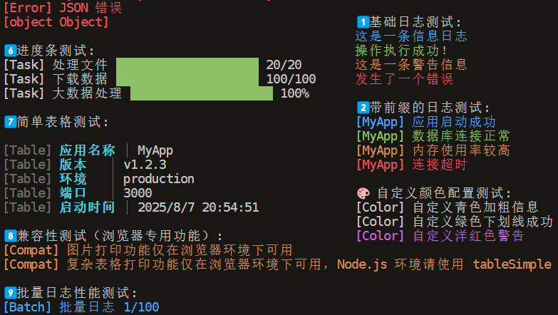

# 🎨 @jl-org/log

<div align="center">

**一个超级美丽的跨平台日志工具** ✨

*同时支持浏览器和 Node.js 环境的彩色日志输出*

[](https://www.npmjs.com/package/@jl-org/log)
[](https://github.com/beixiyo/jl-log/blob/main/LICENSE)
[](https://www.npmjs.com/package/@jl-org/log)

[English](./README.en.md) | **中文**

</div>

## ✨ 特性亮点

| 特性 | 描述 | 状态 |
|------|------|------|
| 🌐 **跨平台支持** | 浏览器 + Node.js 双环境无缝切换 | ✅ |
| 🎨 **美观输出** | 浏览器彩色标签 + Node.js *kleur* 彩色终端 | ✅ |
| 📦 **轻量设计** | 零核心依赖，Node.js 端 *kleur* 按需引入 | ✅ |
| 🔧 **统一 API** | 两端相同接口，学习成本低 | ✅ |
| 🎯 **TypeScript** | 完整类型定义，开发体验佳 | ✅ |
| ⚡ **高性能** | 优化的渲染算法，毫秒级响应 | ✅ |

## 📸 效果预览

### 🖥️ 浏览器环境效果


*浏览器控制台中的彩色标签效果展示*

### 🖥️ Node.js 终端效果  



*Node.js 终端中的彩色文字效果展示*

---

## 📦 快速安装

### 基础安装

```bash
# 使用 pnpm（推荐）
pnpm add @jl-org/log

# 使用 npm
npm install @jl-org/log

# 使用 yarn
yarn add @jl-org/log
```

### Node.js 环境额外依赖

如果需要在 Node.js 环境使用，请安装 *kleur*：

```bash
pnpm add kleur@^4.1.5
```

> 💡 **为什么需要用户安装 kleur？**  
> 为了保持包的轻量性和灵活性，我们将 *kleur* 设置为 peer dependency。这样浏览器环境不会引入不必要的依赖。

## 🚀 快速开始

### 🌐 浏览器环境

```html
<!DOCTYPE html>
<html>
<head>
  <title>Logger Demo</title>
</head>
<body>
  <script type="module">
    import { BrowserLogger } from '@jl-org/log'

    // 创建日志实例
    const logger = new BrowserLogger({
      needLog: () => process.env.NODE_ENV !== 'production',
      prefix: 'MyApp',
      debug: true
    })

    // 基础使用
    logger.info('🚀 应用启动成功')
    logger.success('✅ 数据加载完成')
    logger.warn('⚠️ 内存使用率偏高')
    logger.error('❌ 网络连接失败')
    logger.debug('🐛 调试信息')

    // 方法级配置覆盖
    logger.info('临时前缀测试', { prefix: 'TEMP' })
    logger.debug('临时启用调试', { debug: true })
    logger.error('API 错误', null, { prefix: 'API' })

    // 表格展示
    const users = [
      { id: 1, name: '张三', role: '管理员' },
      { id: 2, name: '李四', role: '用户' }
    ]
    logger.table(users)

    // 图片展示（浏览器独有）
    logger.img('https://example.com/logo.png', 0.5)
  </script>
</body>
</html>
```

### 🖥️ Node.js 环境

```js
import kleur from 'kleur'
import { NodeLogger } from '@jl-org/log'

// 创建日志实例
const logger = new NodeLogger({
  kleur,
  debug: process.env.NODE_ENV === 'development',
  prefix: 'MyApp'
})

// 基础使用
logger.info('🚀 服务器启动成功')
logger.success('✅ 数据库连接正常')
logger.warn('⚠️ 内存使用率较高')
logger.error('❌ Redis 连接失败')
logger.debug('🐛 调试信息：用户 ID = 12345')

// 方法级配置覆盖
logger.info('临时前缀测试', { prefix: 'TEMP' })
logger.debug('临时启用调试', { debug: true })
logger.error('API 错误', null, { prefix: 'API' })

// 自定义颜色配置
const colorLogger = new NodeLogger({
  kleur,
  prefix: 'App',
  colors: {
    infoColor: 'cyan.bold',        // 青色加粗
    successColor: 'green.underline', // 绿色下划线
    warningColor: 'magenta',       // 洋红色
    errorColor: 'red.bold.bgWhite' // 红色加粗白背景
  }
})

colorLogger.info('自定义样式的信息日志')
colorLogger.success('自定义样式的成功日志')

// 进度条（Node.js 独有）
for (let i = 0; i <= 100; i += 10) {
  logger.progress({
    message: '处理数据',
    current: i,
    total: 100,
    displayType: 'percentage'
  })
  await new Promise(resolve => setTimeout(resolve, 100))
}

// 简单表格
logger.tableSimple({
  '应用': 'MyApp',
  '版本': 'v1.0.0',
  '环境': 'production',
  '端口': '3000'
})
```

## 📖 详细文档

### 🎨 BrowserLogger 配置

```typescript
interface LogOpts {
  /** 是否启用日志，支持动态控制 */
  needLog?: () => boolean
  
  /** 是否启用调试模式 */
  debug?: boolean
  
  /** 日志前缀 */
  prefix?: string
  
  /** 自定义颜色配置 */
  infoColor?: string     // 默认: #909399
  errorColor?: string    // 默认: #F56C6C  
  warningColor?: string  // 默认: #E6A23C
  successColor?: string  // 默认: #67C23A
  
  /** 表格样式配置 */
  table?: {
    header?: {
      color?: string     // 默认: #F2F7FF
      bgc?: string       // 默认: #1455CC
    }
    row?: {
      color?: string     // 默认: #FFF
      bgc?: string       // 默认: #656C66
    }
  }
}

/** 方法级配置选项 - 允许临时覆盖构造器配置 */
interface MethodConfig {
  /** 临时覆盖前缀 */
  prefix?: string
  /** 临时覆盖调试模式 */
  debug?: boolean
}
```

### 🖥️ NodeLogger 配置

```typescript
interface NodeLogOpts extends BaseLogOpts {
  /** Kleur 实例（必需） */
  kleur: Kleur
  
  /** 颜色配置 */
  colors?: KleurColorConfig
}

interface KleurColorConfig {
  /** 信息日志颜色，支持 kleur 的所有颜色方法，默认: 'blue' */
  infoColor?: string
  /** 成功日志颜色，默认: 'green' */
  successColor?: string
  /** 警告日志颜色，默认: 'yellow' */
  warningColor?: string
  /** 错误日志颜色，默认: 'red' */
  errorColor?: string
  /** 调试日志颜色，默认: 'gray' */
  debugColor?: string
}
```

### 🔧 通用接口

```typescript
interface ILogger {
  info(message: string, config?: MethodConfig): void
  success(message: string, config?: MethodConfig): void  
  warn(message: string, config?: MethodConfig): void
  error(message: string, error?: any, config?: MethodConfig): void
  debug?(message: string, config?: MethodConfig): void
  img?(url: string, scale?: number): void
  table?<T extends object>(data: T[]): void
}
```

## ⚡ 高级用法

### 🎨 自定义主题

```js
// 暗黑主题
const darkLogger = new BrowserLogger({
  infoColor: '#64B5F6',
  successColor: '#81C784', 
  warningColor: '#FFB74D',
  errorColor: '#E57373'
})

// 彩虹主题  
const rainbowLogger = new BrowserLogger({
  infoColor: '#9C27B0',
  successColor: '#4CAF50',
  warningColor: '#FF9800', 
  errorColor: '#F44336'
})
```

### 🚀 性能优化

```js
// 生产环境关闭日志
const logger = new BrowserLogger({
  needLog: () => process.env.NODE_ENV !== 'production'
})

// 条件日志
const logger = new BrowserLogger({
  needLog: () => window.location.search.includes('debug=true')
})
```

### 📊 数据可视化

```js
// 复杂数据表格
const complexData = [
  { 
    id: 1,
    user: { name: '张三', email: 'zhang@example.com' },
    stats: { views: 1234, likes: 89 },
    active: true 
  }
]
logger.table(complexData)
```

## 🔍 功能对比表

| 功能 | 🌐 浏览器 | 🖥️ Node.js | 📝 说明 |
|------|----------|-----------|--------|
| **基础日志** | ✅ | ✅ | info, success, warn, error |
| **调试日志** | ✅ | ✅ | debug 方法，可控制显示 |
| **前缀支持** | ✅ | ✅ | 两端统一支持自定义前缀 🆕 |
| **方法级配置** | ✅ | ✅ | 支持临时覆盖前缀、调试等 🆕 |
| **错误堆栈** | ✅ | ✅ | 支持 Error 对象展示 |
| **表格打印** | ✅ | ⚠️ | 浏览器完整支持，Node.js 简化版 |
| **图片打印** | ✅ | ❌ | 仅浏览器支持，Node.js 显示警告 |
| **进度条** | ❌ | ✅ | Node.js 独有功能 |
| **彩色输出** | ✅ | ✅ | CSS 样式 vs kleur 终端颜色 |

## 🧪 测试使用

我们提供了完整的测试示例，展示所有功能的使用方法：

### 📁 测试文件说明

- **[`test/browser.html`](./test/browser.html)** - 浏览器测试页面，美观的 UI 界面
- **[`test/browser.js`](./test/browser.js)** - 浏览器测试脚本，包含所有功能演示  
- **[`test/node.js`](./test/node.js)** - Node.js 测试脚本，完整的功能测试

### 🌐 浏览器测试

```bash
# 构建项目
pnpm build

# 启动测试服务器（需要安装 live-server）
npx live-server test/
```

然后在浏览器中打开 `http://localhost:8080/browser.html`，按 F12 打开控制台查看效果。

**测试内容包括：**
- 🎯 基础日志功能
- 🆕 前缀和调试模式
- ⚙️ 方法级配置覆盖  
- 🎨 自定义颜色主题
- 📊 表格数据展示
- 🖼️ 图片打印功能

### 🖥️ Node.js 测试

```bash
# 安装测试依赖
pnpm add kleur

# 构建并运行测试
pnpm build && node test/node.js
```

**测试内容包括：**
- 🎯 基础日志功能
- 🆕 方法级配置覆盖
- 🏷️ 前缀和调试模式
- 📊 进度条显示
- ⚡ 性能测试

## 📋 最佳实践

### 🏗️ 项目集成

```js
// utils/logger.js
import { BrowserLogger } from '@jl-org/log'

export const logger = new BrowserLogger({ })

// 使用
import { logger } from './utils/logger'
logger.info('用户登录成功')
```

### 🎯 类型安全

```typescript
// types/logger.d.ts
import type { BrowserLogger } from '@jl-org/log'

declare global {
  interface Window {
    logger: BrowserLogger
  }
}

// 全局使用
window.logger = new BrowserLogger()
window.logger.info('TypeScript 支持完美')
```

### 🔧 开发设置

```bash
# 克隆项目
git clone https://github.com/beixiyo/jl-log.git
cd jl-log

# 安装依赖
pnpm install

# 开发构建
pnpm build

# 运行测试
pnpm test
```

---

<div align="center">

**如果这个项目对你有帮助，请给个 ⭐ Star 支持一下！**

Made with ❤️ by [CJL](https://github.com/beixiyo)

</div>
